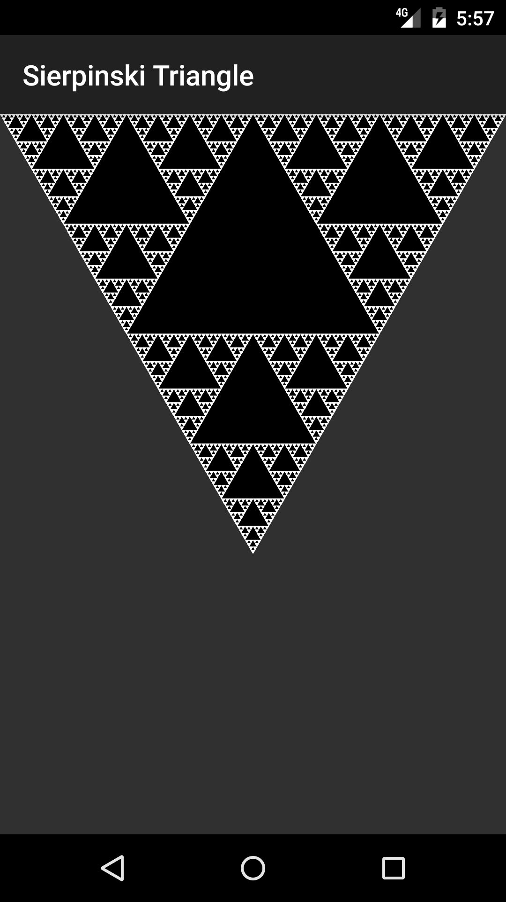

# Sierpinski Triangle

The goal of this project is to paint a Sierpinski Triangle in an Android App.

This application uses Scala and the gradle build system in order to make it as
easy as possible for Android Developers to use their workflow and also profit from
the possibilities scala has to offer.

At the time of implementation it was necessary to patch the scala gradle plugin
in order to get the unit tests to work, see the patched [Gradle Android Scala Plugin](https://github.com/rladstaetter/gradle-android-scala-plugin) .

